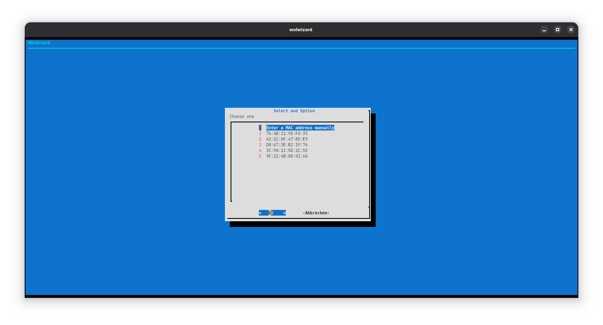
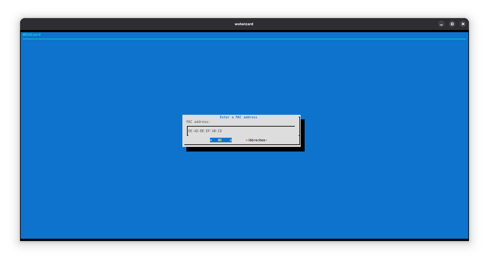

# WOLWizard: The Wake-on-LAN wizard
A tool to send WOL packets using user-friendly TUI interface

## Dependencies
- A POSIX-compatible shell
- [`wakeonlan`](https://github.com/jpoliv/wakeonlan/): This is intended to be replaced with a custom implementation in the future 
  - Package `wakeonlan` in the [Debian](https://packages.debian.org/search?keywords=wakeonlan)/[Ubuntu](https://packages.ubuntu.com/search?keywords=wakeonlan) repositories
  - Package [`wakeonlan`](https://archlinux.org/packages/extra/any/wakeonlan/) in the AUR
  - Package [`net-misc/wakeonlan`](https://packages.gentoo.org/packages/net-misc/wakeonlan) for Gentoo
  - Nixpkg [`wakeonlan`](https://search.nixos.org/packages?show=wakeonlan)

## Installation
```sh
sudo make install
```

## Images
 Main screen
 MAC address entry